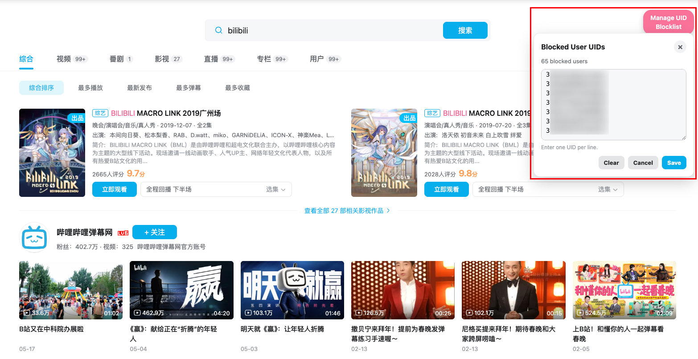

# Bilibili Video Blocker

Bilibili's built-in blocklist is account-bounded and sometimes limited because you want to block more users than you could. This script stores your own in-browser blocklist and hides matching video cards on supported pages.

## Installation

1. Install a userscript manager such as [Tampermonkey](https://www.tampermonkey.net/).
1. Install the script using one of these options:
   - [Quick install](https://github.com/mr-yifeiwang/bilibili-video-blocker/raw/refs/heads/master/main.user.js) the script from GitHub.
   - Copy `main.user.js` into a new Tampermonkey script manually.
1. Open or refresh [bilibili.com](https://www.bilibili.com/) after installation.

## Usage

A Bilibili UID is the user ID in the User Space URL. For example, the UID in `https://space.bilibili.com/8047632` is `8047632`.

1. Open a user's User Space.
1. Click <button>Block User by UID</button>. Then, matching videos will be hidden on supported Bilibili pages.
1. Manage the blocklist by clicking <button>Manage UID Blocklist</button> on Bilibili's home page (`https://www.bilibili.com/`) or search page (`https://search.bilibili.com/`).

